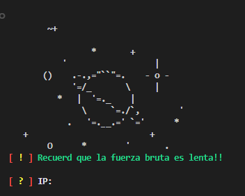

<div align=center>

# -    FTPBRUTER-ZOOM    -


</a>

<a href="https://gist.github.com/Apolo1061"></a>
<a href=""></a>
<a href="https://gist.github.com/Apolo1061"></a>
<a href="https://github.com/Apolo1061"></a>
<a href="https://github.com/Apolo1061"></a>

#### FTPBRUTER-ZOOM es una herramienta desarrollada en el lenguaje de programacion python, Este codigo tiene con fin poder dar una ejemplificacion de como se implementan de forma malisiosa python para poder realizar un ataque de fuerza bruta a servidores ftp

## 🛑 Aviso 🛑
#### Reglas en el LICENSE me expropio de la responsabilidad si este codigo es usado de manera malisiosos no apruebo el uso ilegal ni lo condeno

# Instalacion

```
git clone https://github.com/Apolo1061/ftpbruter-zoom.git
```
```
cd ftpbruter-zoom
```
```
python3 ftp-bruter.py
```

# YO
[](https://github.com/Apolo1061)
